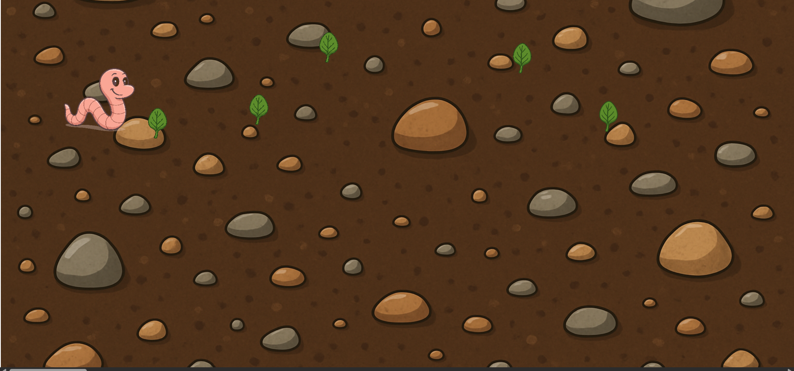

# 🪱 Worm-Eater Game

A simple and fun browser game where a cute worm moves around and eats randomly placed food items on the screen. Made with basic HTML, CSS, and JavaScript.

## 📸 Screenshots

## ⚠️ Limitations

- ❌ **This project is not responsive.**
- ✅ It works properly **only on screens with resolution 1920×1080**.
- 📱 Not suitable for mobile devices or smaller screens.

## 🚀 Live Demo

🎥 [Watch Demo Video]( https://setarehomadian80.github.io/soil-snakeGame/)

## 🧠 Technologies Used

- **HTML**: for structure and layout
- **CSS**: for styling the worm, food, and game area
- **JavaScript**: for movement logic, random food generation, and collision detection

## 🧰 JavaScript Features

- `addEventListener()` for keyboard controls
- `Math.random()` to place food randomly
- `getBoundingClientRect()` for collision detection
- `style.transform` to flip the worm's direction
- `scrollTo()` for smooth camera movement

## 📁 How to Run

1. Clone the repo
2. Open `index.html` in your browser
3. Use arrow keys to move the worm and eat food!

Enjoy 😊
